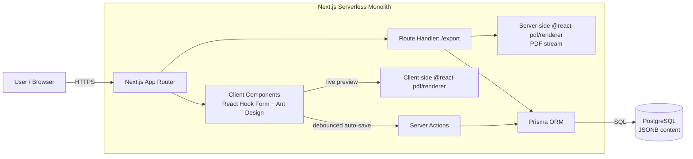

# Resume Manager

A web application (MVP) for creating, editing, versioning, and exporting resumes (CVs) to **ATS-friendly PDF**.

> Built as a **serverless monolith** for the fastest possible time-to-market: one repository, one deployment pipeline, one runtime.

---

## Table of Contents

- [Overview](#overview)
- [Key Features](#key-features)
- [Architecture at a Glance](#architecture-at-a-glance)
- [Technology Stack](#technology-stack)
- [Repository Structure](#repository-structure)
- [Getting Started](#getting-started)
- [Environment Variables](#environment-variables)
- [Data Model](#data-model)
- [ATS Compatibility](#ats-compatibility)
- [Deployment](#deployment)
- [Documentation Index](#documentation-index)

---

## Overview

Job seekers need a fast way to maintain a single source of truth for their professional history and to spin off tailored resume drafts per application — without fighting with word processors or breaking the parsing done by **Applicant Tracking Systems (ATS)**.

Resume Manager solves this with:

1. A **structured editor** with real-time auto-save.
2. A **live PDF preview** rendered directly from the form state.
3. **Lightweight versioning** (drafts) that avoids over-normalizing the database.
4. **ATS-optimized PDF export** — a real, selectable text layer, single-column reading order, and explicit section headings.

### Project Priorities

| Priority | Meaning |
|----------|---------|
| **Monolithic architecture** | Fast time-to-market, single code repository, simplified deployment. |
| **ATS compatibility** | Generated PDFs must contain a parseable text layer in logical reading order (no complex graphical grids). |
| **Efficient versioning** | Easy draft management without redundant relational tables. |

---

## Key Features

- 📝 **Section-based editor** — Experience, Education, Skills, Summary, etc.
- 💾 **Auto-save** — a debounced Server Action persists form state every 3–5 seconds.
- 👁️ **Live preview** — client-side PDF rendering reflects the form state in real time.
- 🗂️ **Draft versioning** — document-oriented (JSONB) storage keeps versioning cheap.
- 📄 **ATS-safe export** — server-rendered PDF stream with embedded standard fonts.

---

## Architecture at a Glance



For the full breakdown see **[prd/architecture.md](./prd/architecture.md)**.

---

## Technology Stack

| Layer | Technology |
|-------|-----------|
| **Core framework** | Next.js (App Router) + TypeScript |
| **UI** | Ant Design (antd) |
| **Forms & validation** | React Hook Form + Zod (shared client/server schemas) |
| **PDF generation** | @react-pdf/renderer (client-side preview + server-side export) |
| **Database** | PostgreSQL |
| **ORM** | Prisma |

Full stack rationale and evaluated alternatives: **[prd/tech-stack.md](./prd/tech-stack.md)**.

---

## Repository Structure

```
resume-manager/
├── README.md               # This file
├── CLAUDE.md               # Guidance for Claude Code
├── prd/
│   ├── tech-stack.md          # Stack decisions + alternatives
│   ├── architecture.md        # Solution architecture & deployment topology
│   ├── frontend-design.md     # UI design system (palette, light/dark, layout)
│   ├── implementation-plan.md # Stepped build plan
│   └── skills.md              # Claude Code skills recommended for deployment
├── app/                    # Next.js App Router (routes, server actions)
│   ├── (editor)/           # Editor pages (client components)
│   └── api/export/         # PDF export Route Handler
├── components/             # Ant Design compositions + shared UI
│   └── pdf/                # @react-pdf/renderer document components
├── lib/
│   ├── schemas/            # Zod schemas (shared validation)
│   └── db.ts               # Prisma client singleton
├── prisma/
│   └── schema.prisma       # Data model (document-oriented)
└── ...
```

> The `app/`, `components/`, `lib/`, and `prisma/` directories describe the target layout; scaffold them as implementation begins.

---

## Getting Started

### Prerequisites

- **Node.js** ≥ 20 LTS
- **pnpm** ≥ 9 (or npm/yarn)
- **PostgreSQL** ≥ 15 (local via Docker, or a managed instance)

### Local Setup

```bash
# 1. Install dependencies
pnpm install

# 2. Start a local database (Docker example)
docker run --name resume-db -e POSTGRES_PASSWORD=postgres \
  -e POSTGRES_DB=resume_manager -p 5432:5432 -d postgres:16

# 3. Configure environment
cp .env.example .env.local   # then fill in DATABASE_URL

# 4. Apply the schema
pnpm prisma migrate dev

# 5. Run the dev server
pnpm dev
```

The app will be available at `http://localhost:3000`.

---

## Environment Variables

| Variable | Required | Description |
|----------|:--------:|-------------|
| `DATABASE_URL` | ✅ | PostgreSQL connection string used by Prisma. |
| `NEXTAUTH_SECRET` | ⬜ | Session secret (once authentication is added). |
| `NEXTAUTH_URL` | ⬜ | Public base URL of the deployment. |

Keep secrets out of version control — use `.env.local` locally and the platform's secret manager in production.

---

## Data Model

To keep the MVP database simple, the resume payload is stored as a **document** (JSONB) rather than a normalized graph of tables (separate `experience`, `education`, ... tables). This makes drafting and versioning cheap.

```prisma
model Resume {
  id        String   @id @default(cuid())
  userId    String
  title     String
  status    Status   @default(DRAFT)   // DRAFT | PUBLISHED
  content   Json                        // full resume payload (validated by Zod)
  createdAt DateTime @default(now())
  updatedAt DateTime @updatedAt

  @@index([userId, status])
}

enum Status {
  DRAFT
  PUBLISHED
}
```

The `content` field is validated on **both** the client and the server with the **same Zod schema**, so the JSONB blob never drifts from an expected shape.

---

## ATS Compatibility

ATS parsers do not "see" design — they read characters and their order. The PDF pipeline follows three hard rules:

1. **Text, not images** — the PDF is natively rendered with embedded standard fonts (e.g., Roboto). No text is rasterized.
2. **Linear reading order** — layout reads top-to-bottom. Avoid multi-column layouts for key sections (Experience) so the parser doesn't interleave headings with descriptions.
3. **Semantic clarity** — section names (Experience, Education, Skills) are written as plain text, never replaced by iconography alone.

---

## Deployment

The serverless monolith deploys cleanly to a first-party Next.js host or a container platform. See **[prd/architecture.md](./prd/architecture.md)** for topology and trade-offs, and **[prd/skills.md](./prd/skills.md)** for the recommended Claude Code skills to drive CI/CD, verification, and reviews during deployment.

**Recommended baseline:**

- **Hosting:** Vercel (zero-config Next.js) — or a Docker image on Fly.io / Railway / AWS ECS for portability.
- **Database:** A managed serverless Postgres (Neon / Supabase / Vercel Postgres).
- **CI/CD:** GitHub Actions → build, typecheck, `prisma migrate deploy`, deploy.

---

## Documentation Index

| Document | Purpose |
|----------|---------|
| [prd/tech-stack.md](./prd/tech-stack.md) | Technology choices with rationale and alternatives. |
| [prd/architecture.md](./prd/architecture.md) | Solution architecture, PDF pipeline, deployment topology. |
| [prd/frontend-design.md](./prd/frontend-design.md) | UI design system: palette, light/dark mode, typography, responsive layout. |
| [prd/implementation-plan.md](./prd/implementation-plan.md) | Dependency-ordered, stepped build plan for the MVP. |
| [prd/skills.md](./prd/skills.md) | Claude Code skills for the deployment lifecycle. |
