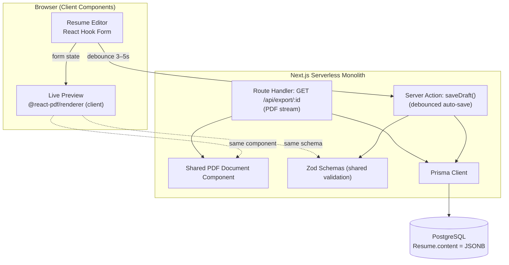
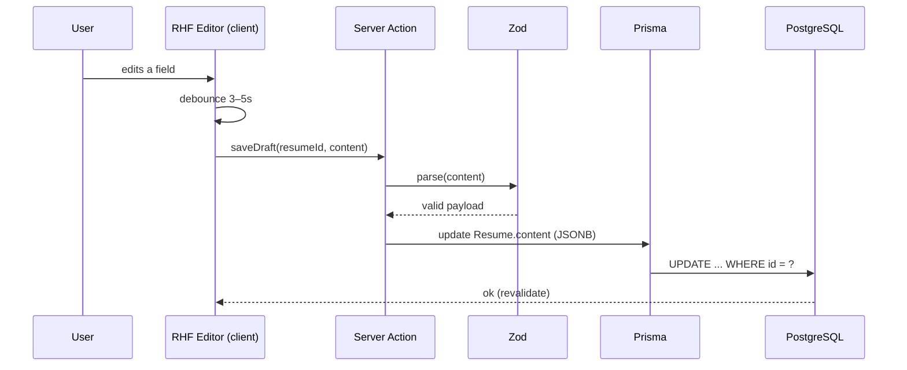
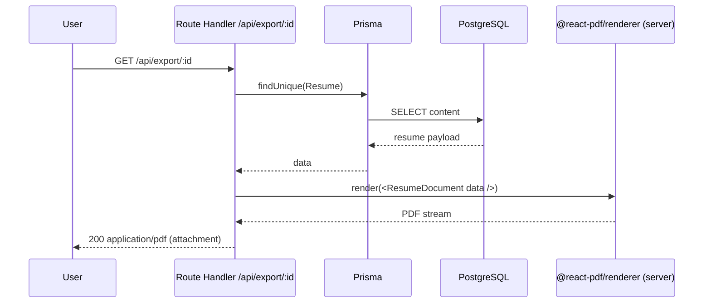
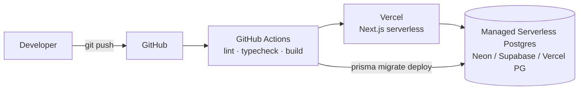
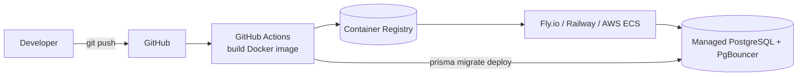
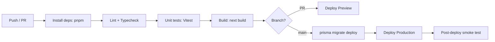

# Solution Architecture

> Role perspective: **DevOps Architect**. This document describes the runtime architecture, the PDF pipeline, the data flows, the deployment topology, and the operational concerns for the Resume Manager MVP.

---

## 1. Architectural Style: Serverless Monolith

A **single Next.js application** contains everything: the UI, the mutation logic (Server Actions), the export endpoint (Route Handler), and the data access layer (Prisma). There is no separate API service.

**Why a monolith for the MVP**

- **One repository, one pipeline, one deployable** → the simplest path to production.
- **No network hop** between "frontend" and "backend" — Server Actions run in the same runtime.
- **Lowest cognitive and operational overhead** while validating the product.

The design keeps **seams** (validation schemas, PDF component, data layer) clean so the monolith can be split later if scale demands it — without a rewrite.

---

## 2. Logical Architecture



### Layer responsibilities

| Layer | Responsibility |
|-------|----------------|
| **Client components** | Render the editor, manage form state, drive the live preview, trigger auto-save. |
| **Server Actions** | Validate (Zod) and persist the draft `content` (JSONB) for the active resume. |
| **Route Handler (`/api/export`)** | Fetch the final resume, map it to the PDF component, stream the `.pdf` back. |
| **Shared PDF component** | Single source of truth for layout — used by both preview (client) and export (server). |
| **Zod schemas** | Single source of truth for validation and the JSONB payload shape. |
| **Prisma / PostgreSQL** | Type-safe persistence; document-oriented `content` column. |

---

## 3. Key User Flows

### 3.1 Editor & Auto-save

1. The user fills sections in a React Hook Form interface.
2. A **debounce** (3–5 s, or on field blur) invokes a Next.js **Server Action**.
3. The action validates with Zod and **overwrites** the `content` (JSONB) field of the active **DRAFT**.



### 3.2 Live Preview

A PDF viewer component sits next to the editor and renders the **current form state in real time** using the **client-side** `@react-pdf/renderer`. Because preview and export share the same document component, "what you see" equals "what you export."

### 3.3 Export / Download



The request hits a backend endpoint (Next.js Route Handler). The server pulls the final resume data, maps it onto the PDF component, renders a file **stream**, and returns a safe `.pdf` to the client.

---

## 4. Data Model — Document-Oriented Versioning

To minimize database complexity at the MVP stage, the design **avoids a distributed relational structure** (separate tables for education, experience, etc.) in favor of a **document approach**: the whole resume lives in a JSONB `content` column.

```prisma
model Resume {
  id        String   @id @default(cuid())
  userId    String
  title     String
  status    Status   @default(DRAFT)   // DRAFT | PUBLISHED
  content   Json                        // full payload, validated by Zod
  createdAt DateTime @default(now())
  updatedAt DateTime @updatedAt

  @@index([userId, status])
}

enum Status { DRAFT PUBLISHED }
```

**Versioning strategy for the MVP**

- Each row is a self-contained document; a "new version" is a cheap row copy — no fan-out across child tables.
- If full history/audit is needed later, add a `ResumeVersion` table that stores immutable JSONB snapshots keyed by `resumeId`, without touching the editor flow.

**Trade-off:** querying *inside* the resume (e.g., "all users who know React") is harder than in a normalized schema. That is an acceptable MVP trade — the product reads/writes whole documents, not fields.

---

## 5. ATS-Optimized PDF Pipeline

ATS systems don't "see" design — they read characters and their order. Technical guidelines enforced in the shared PDF component:

1. **Text layer, not images** — the PDF is natively rendered with **embedded standard fonts** (e.g., Roboto). Text is never rasterized.
2. **Linear reading order** — layout reads top-to-bottom. **Avoid multi-column layouts** for key sections (Experience) so a parser doesn't mix headings with duty descriptions.
3. **Semantic clarity** — section names (Experience, Education, Skills) are written as **plain text**, never replaced solely by iconography.

> These rules are architectural constraints, not styling suggestions. Any template must pass them.

---

## 6. Deployment Topology

Two supported paths. The MVP recommendation is **Path A** for speed; **Path B** is the portable escape hatch.

### Path A — First-party host (recommended for MVP)



- **Zero-config Next.js hosting**, preview deployments per PR, automatic HTTPS/CDN.
- **Managed serverless Postgres** with a built-in pooler.
- Fastest route to a production URL.

### Path B — Containerized (portable)



- A single Docker image runs the Next.js server anywhere.
- Choose this when you need cloud portability, VPC placement, or to avoid vendor lock-in.

### Environments

| Environment | Purpose | Data |
|-------------|---------|------|
| **Preview** | Per-PR ephemeral deploy | Disposable branch DB or shared dev DB |
| **Staging** | Pre-prod smoke tests | Anonymized/seed data |
| **Production** | Live | Managed Postgres w/ backups |

---

## 7. CI/CD Pipeline



**Pipeline gates**

1. `pnpm install --frozen-lockfile`
2. `eslint` + `tsc --noEmit`
3. `vitest run` (and optionally Playwright e2e against the preview URL)
4. `next build`
5. On `main`: `prisma migrate deploy` → deploy → smoke test the `/api/export` path.

---

## 8. Operational Concerns (DevOps checklist)

| Concern | Guidance |
|---------|----------|
| **Serverless function sizing** | Server-side PDF rendering is CPU/memory-bound. Give the `/api/export` function extra memory/timeout; consider a dedicated (non-edge) Node runtime. |
| **DB connection pooling** | Serverless + Prisma needs a pooler (Prisma Accelerate, PgBouncer, or a driver adapter) to avoid connection exhaustion. |
| **Cold starts** | Keep the PDF path on a warm Node function; avoid bundling a headless browser (a reason `@react-pdf/renderer` was chosen). |
| **Secrets** | Store `DATABASE_URL` and auth secrets in the platform's secret manager; never in the repo. |
| **Backups** | Enable automated Postgres backups + point-in-time recovery on the managed instance. |
| **Observability** | Add Sentry for errors; log export latency and auto-save failures. |
| **Auto-save load** | Debounce is the primary throttle; add per-user rate limiting on the Server Action if abuse appears. |
| **Migrations** | Migrations run in CI (`prisma migrate deploy`), never manually against prod. |

---

## 9. Non-Functional Targets (MVP)

| Attribute | Target |
|-----------|--------|
| Auto-save round trip | < 500 ms p95 |
| PDF export (server) | < 3 s p95 for a typical resume |
| Live preview update | Perceptually instant (client-side) |
| Availability | 99.5% (single-region MVP) |
| RPO / RTO | ≤ 24h / ≤ 1h (managed backups) |

---

## 10. Evolution Path (post-MVP)

The monolith is intentionally decomposable. Likely next steps, in order of probable need:

1. **Auth** — add Auth.js; introduce a real `User` model.
2. **Version history** — `ResumeVersion` snapshots for undo/audit.
3. **Async export** — move heavy PDF rendering to a queue/worker if export volume grows.
4. **Template marketplace** — pluggable PDF layouts (each still passing ATS rules).
5. **Selective normalization** — extract structured fields (skills, dates) into tables for search/analytics, keeping JSONB as the canonical draft store.
