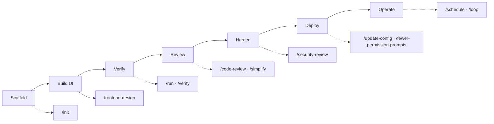

# Recommended Skills for Deployment

> This document proposes **Claude Code skills** to use during the build-out and deployment lifecycle of Resume Manager. Each skill is mapped to the stage where it delivers the most value, with a concrete example of *when* to invoke it.
>
> Skills are invoked with a leading slash (e.g. `/code-review`) or, for design skills, applied automatically when relevant. Treat this as the team's "playbook" for driving the project forward with Claude Code.

---

## Skills Mapped to the Delivery Lifecycle

---

## 1. Project Bootstrapping

### `/init`
Generates a `CLAUDE.md` that documents the codebase for future Claude Code sessions.

- **When:** Right after the Next.js app is scaffolded and the folder layout is settled.
- **Why:** Captures the stack, conventions, and commands so every later session starts with accurate context (build command, test command, Prisma workflow).
- **Deployment value:** Consistent, low-friction onboarding for both humans and agents.

---

## 2. Building the UI

### `frontend-design`
Guidance for distinctive, intentional visual design when building or reshaping UI.

- **When:** Designing the editor layout, the resume templates, and the marketing/landing surface.
- **Why:** The editor and the PDF templates are the product's face; this skill helps avoid a templated, default look and keeps typography intentional — which also aligns with the **ATS-safe, readable** typographic goals.
- **Deployment value:** A polished editor increases perceived quality before public launch.

> Note: `dataviz` is available for charts, but this MVP has no analytics dashboards yet — defer it until post-MVP reporting features appear.

---

## 3. Verification (pre-merge)

### `/run`
Launches and drives the app to confirm a change works in the real app (not just tests).

- **When:** After implementing the editor, the auto-save Server Action, or the export endpoint.
- **Why:** Confirms the live preview renders and the `.pdf` actually downloads — behavior you can't fully trust from unit tests alone.

### `/verify`
Exercises a change end-to-end and observes behavior before committing.

- **When:** Before committing any nontrivial change to product source (auto-save debounce, PDF stream, JSONB persistence).
- **Why:** Drives the affected flow and observes the result — critical for the **PDF pipeline**, where "it compiles" ≠ "the text layer is parseable."
- **Deployment value:** Catches runtime regressions before they reach CI/CD.

---

## 4. Code Review & Cleanup (pre-merge)

### `/code-review`
Reviews the current diff for correctness bugs and reuse/simplification/efficiency issues, at a chosen effort level (`low` → `max`, plus `ultra` for a deep multi-agent cloud review).

- **When:** On every meaningful diff before opening/merging a PR.
- **Why:** Independent scrutiny of correctness — especially valuable around Zod validation boundaries, the shared PDF component, and Prisma queries.
- **Tip:** Use `/code-review ultra` before a significant release (e.g., first production deploy) for the deepest pass.

### `/review`
Reviews a GitHub pull request (as opposed to the local working diff).

- **When:** Reviewing a teammate's PR on GitHub.

### `/simplify`
Reviews changed code for reuse, simplification, and altitude cleanups, then applies fixes (quality only, not bug-hunting).

- **When:** After a feature works but the code has grown organically (e.g., the editor's form wiring).
- **Why:** Keeps the monolith maintainable so its clean "seams" (for future decomposition) don't erode.

---

## 5. Security Hardening (pre-deploy)

### `/security-review`
Runs a security review of pending changes on the current branch.

- **When:** Before the first production deploy, and before any change touching auth, file download, or user input.
- **Why:** The export endpoint streams files by `id` and the app persists user-supplied JSONB — both are surfaces worth auditing for **authorization (IDOR)**, injection, and unsafe input.
- **Deployment value:** A documented security pass is a sensible release gate.

---

## 6. Deployment Configuration & Ergonomics

### `/update-config`
Configures the Claude Code harness via `settings.json` — permissions, environment variables, and **hooks** for automated behaviors.

- **When:** Standardizing the repo's Claude Code setup, e.g. a hook that runs `pnpm lint` after edits, or granting permissions for `pnpm`/`prisma`/`docker` commands.
- **Why:** Encodes team conventions and reduces repetitive approvals during the deployment workflow.

### `/fewer-permission-prompts`
Scans transcripts for common safe commands and builds a project allowlist in `.claude/settings.json`.

- **When:** Once the CI/CD and local commands stabilize (`pnpm build`, `prisma migrate`, `docker ...`).
- **Why:** Fewer interruptions during deploy-related iteration → faster feedback loops.

---

## 7. Operations & Automation (post-deploy)

### `/schedule`
Creates/manages scheduled cloud agents (cron routines) — recurring or one-off.

- **When:** Automating recurring maintenance, e.g. a nightly dependency-audit summary or a scheduled check that production `/api/export` still returns a valid PDF.
- **Why:** Turns operational vigilance into automation instead of manual checks.

### `/loop`
Runs a prompt or slash command on a recurring interval (or self-paced).

- **When:** Polling a long-running deploy or CI run, or repeatedly babysitting PRs during a release window.
- **Why:** Keeps an eye on in-flight deployment state without manual re-triggering.

---

## Supporting Reference Skills (on demand)

| Skill | Use it when… |
|-------|--------------|
| `claude-api` | Adding any Claude/Anthropic-powered feature later (e.g., AI resume suggestions) — reference for model IDs, pricing, tool use, and caching. |
| `dataviz` | Building post-MVP analytics dashboards or usage charts. |
| `skill-creator` | Codifying a repeatable team workflow into a custom project skill. |
| `keybindings-help` | Customizing Claude Code keyboard shortcuts for the team's workflow. |

---

## Recommended Cadence (quick reference)

| Trigger | Skill(s) |
|---------|----------|
| New feature branch scaffolded | `/init` (once), `frontend-design` (UI work) |
| Before every commit of product code | `/verify`, `/run` |
| Before opening a PR | `/code-review`, `/simplify` |
| Reviewing others' PRs | `/review` |
| Before a production release | `/security-review`, `/code-review ultra` |
| Standardizing the repo | `/update-config`, `/fewer-permission-prompts` |
| After deploy / ongoing ops | `/schedule`, `/loop` |

> **Principle:** *verify → review → harden → deploy.* Never skip `/verify` and `/security-review` on the PDF export and JSONB persistence paths — they are the two highest-risk surfaces in this MVP.
